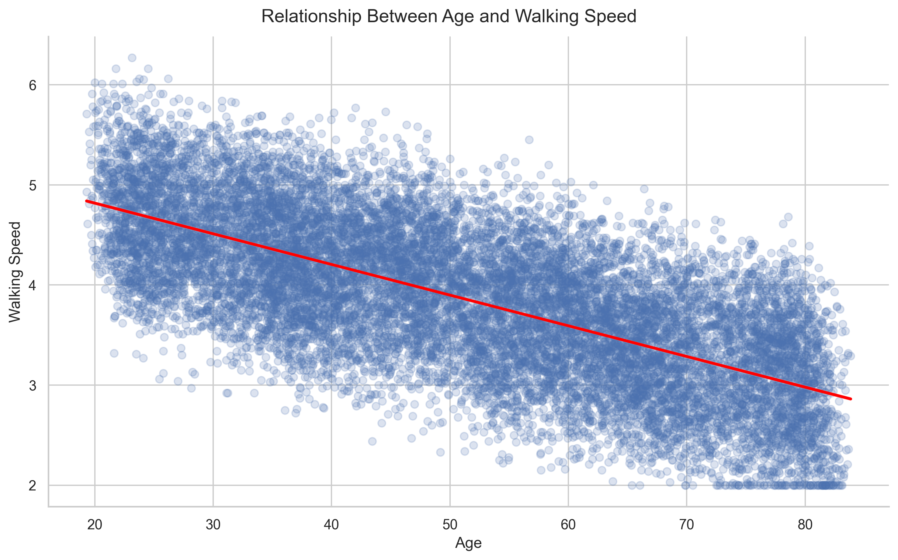
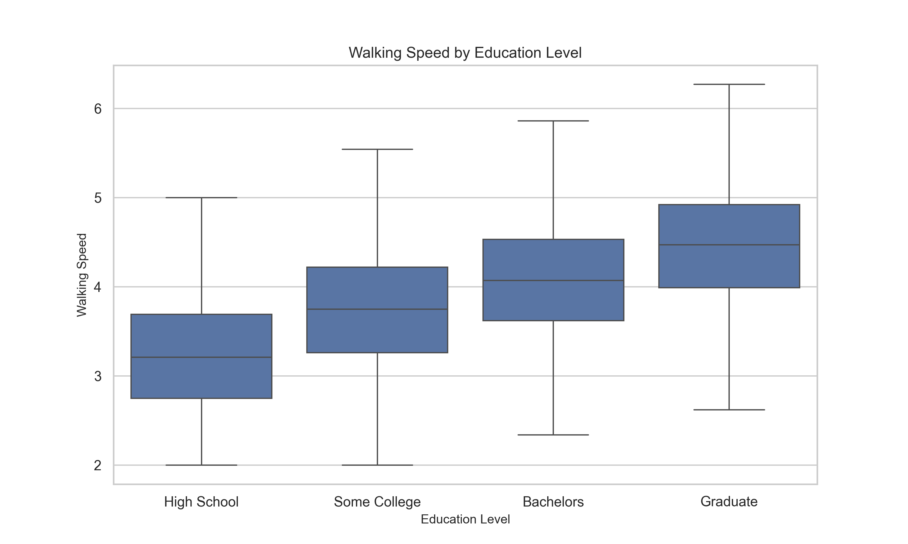
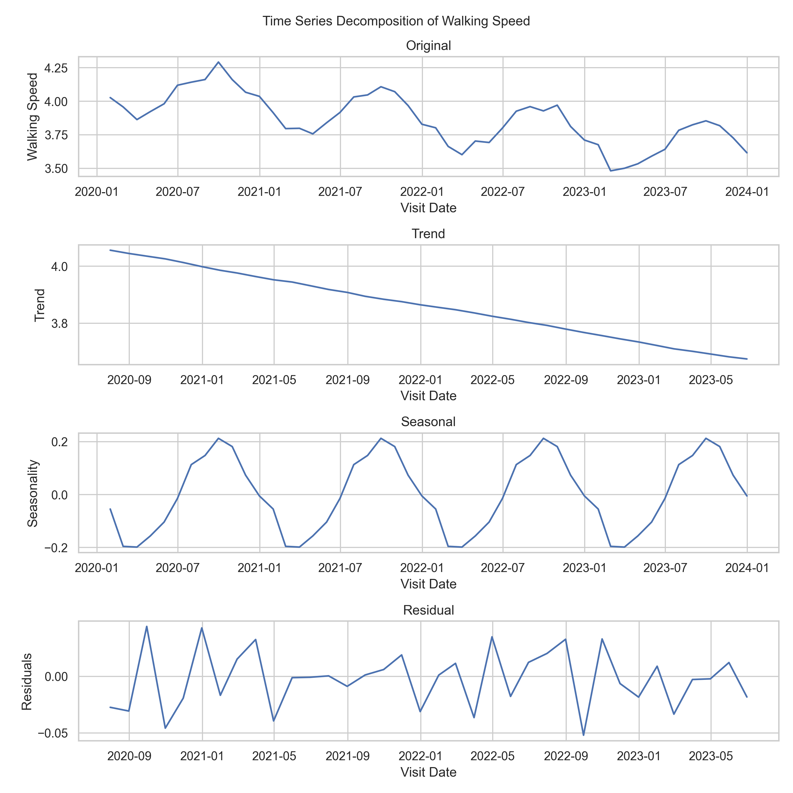

# **Summary**

## **Question 1**

**Total number of visits:** 15402

**First few records of ms_data.csv file:**

| patient_id | visit_date | age   | education_level | walking_speed |
|------------|------------|-------|-----------------|---------------|
| P0001      | 2020-06-26 | 74.1  | Some College    | 3.23          |
| P0001      | 2020-09-29 | 74.36 | Some College    | 3.31          |
| P0001      | 2021-01-06 | 74.63 | Some College    | 3.11          |
| P0001      | 2021-03-30 | 74.86 | Some College    | 2.6           |
| P0001      | 2021-07-13 | 75.14 | Some College    | 3.08          |

## **Question 2**

**Mean walking speed by education level:**

-   High School: 3.260201528839472

-   Some College: 3.676092645904214

-   Bachelors: 4.052783389450056

-   Graduate: 4.4649

**Mean costs by insurance type:**

-   Basic: 99.982289483896

-   Premium: 150.09039495450787

-   Platinum: 200.0132409460458

**Linear regression model for age effect on walking speed:**

-   Age coefficient: -0.03

-   P-value: 0.00

-   R-squared: 0.48

**Walking speed trend over time (Decomposition plot):**

## **Question 3**

**Regression model of education and age effect on walking speed:**

-   Intercept coefficient = 4.81, 95% CI\[4.79, 4.83\], p-value = 0.00
-   education_level\[T.Some College\] coefficient = 0.40, 95% CI\[0.38, 0.41\], p-value = 0.00
-   education_level\[T.Bachelors\] coefficient = 0.80, 95% CI\[0.78, 0.81\], p-value = 0.00
-   education_level\[T.Graduate\] coefficient = 1.20, 95% CI\[1.18, 1.21\], p-value = 0.00
-   age coefficient = -0.03, 95% CI\[-0.03, -0.03\], p-value = 0.00

**Regression model of education level and age effect on walking speed (accounting for repeated measures):**

-   Intercept coefficient = 4.81, 95% CI\[4.79, 4.83\], p-value = 0.00
-   education_level\[T.Some College\] coefficient = 0.40, 95% CI\[0.38, 0.41\], p-value = 0.00
-   education_level\[T.Bachelors\] coefficient = 0.80, 95% CI\[0.78, 0.81\], p-value = 0.00
-   education_level\[T.Graduate\] coefficient = 1.20, 95% CI\[1.18, 1.21\], p-value = 0.00
-   age coefficient = -0.03, 95% CI\[-0.03, -0.03\], p-value = 0.00
-   patient_id Var coefficient = 0.00, 95% CI\[-0.01, 0.01\], p-value = 1.00

**ANOVA of walking speed based on age and education level:**

-   education_level F = 9127.72, p-value = 0.00
-   age F = 38925.61, p-value = 0.00
-   Residual F = nan, p-value = nan

**Regression model of insurance type effect on visit cost:**

-   Intercept coefficient = 99.98, 95% CI\[99.71, 100.26\], p-value = 0.00
-   insurance_type\[T.Platinum\] coefficient = 100.03, 95% CI\[99.65, 100.41\], p-value = 0.00
-   insurance_type\[T.Premium\] coefficient = 50.11, 95% CI\[49.71, 50.50\], p-value = 0.00

**ANOVA of visit cost based on insurance type:**

-   insurance_type F = 131202.96, p-value = 0.00

-   Residual F = nan, p-value = nan

-   The effect size (Eta Squared) of insurance type is 0.94, indicating that 94.46% of the variance in visit cost is explained by insurance type.

**Regression model of education and age interaction and other confounders effect on walking speed:**

-   Intercept Coefficient = 4.77 (95% CI: \[4.70, 4.83\], p-value = 0.00)
-   education_level\[T.Some College\] Coefficient = 0.44 (95% CI: \[0.39, 0.48\], p-value = 0.00)
-   education_level\[T.Bachelors\] Coefficient = 0.82 (95% CI: \[0.78, 0.87\], p-value = 0.00)
-   education_level\[T.Graduate\] Coefficient = 1.20 (95% CI: \[1.15, 1.24\], p-value = 0.00)
-   insurance_type\[T.Platinum\] Coefficient = -0.03 (95% CI: \[-0.08, 0.03\], p-value = 0.32)
-   insurance_type\[T.Premium\] Coefficient = -0.01 (95% CI: \[-0.04, 0.02\], p-value = 0.39)
-   age Coefficient = -0.03 (95% CI: \[-0.03, -0.03\], p-value = 0.00)
-   age:education_level\[T.Some College\] Coefficient = -0.00 (95% CI: \[-0.00, 0.00\], p-value = 0.06)
-   age:education_level\[T.Bachelors\] Coefficient = -0.00 (95% CI: \[-0.00, 0.00\], p-value = 0.24)
-   age:education_level\[T.Graduate\] Coefficient = -0.00 (95% CI: \[-0.00, 0.00\], p-value = 0.96)
-   visit_cost Coefficient = 0.00 (95% CI: \[-0.00, 0.00\], p-value = 0.32)

## **Question 4**

**Walking speed vs. age plot:**

**Walking speed vs. education level plot:**

**Walking speed vs. age and education level interaction plot:**

**Mean visit costs vs. insurance type plot:**

**Cost distributions vs. insurance type plot:**

**Walking speed, age, and visit cost pair plots:**

**Walking Speed vs. Age faceted plots (by education level and insurance types):**

**Walking speed trend over time (Decomposition) plots:**

