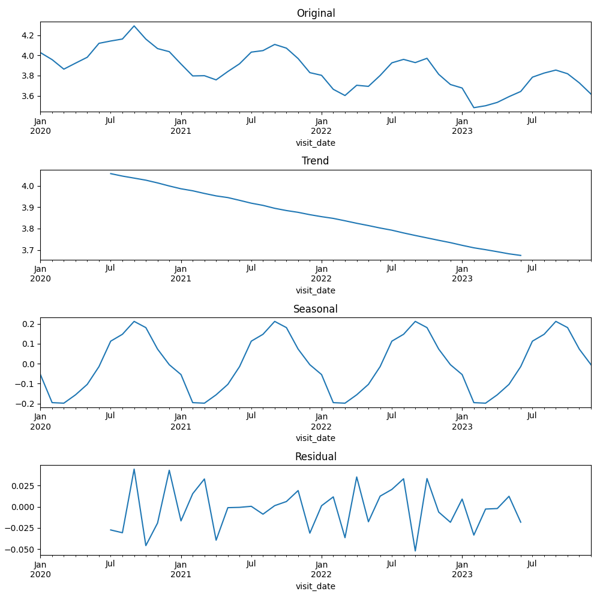

# **Summary**

## **Question 1**

**Total number of visits:** 15422

**First few records of ms_data.csv file:**

| patient_id | visit_date | age   | education_level | walking_speed |
|------------|------------|-------|-----------------|---------------|
| P0001      | 2020-03-18 | 57.02 | Bachelors       | 4.56          |
| P0001      | 2020-06-23 | 57.28 | Bachelors       | 3.8           |
| P0001      | 2020-09-12 | 57.51 | Bachelors       | 4.41          |
| P0001      | 2020-12-12 | 57.75 | Bachelors       | 3.86          |
| P0001      | 2021-03-04 | 57.98 | Bachelors       | 3.79          |

## **Question 2**

**Mean walking speed by education level:**

-   High School: 3.226342737722048

-   Some College: 3.725444557996934

-   Bachelors: 4.069816057668407

-   Graduate: 4.454424391577796

**Mean costs by insurance type:**

-   Basic: 99.96647021679647

-   Premium: 149.81565217391304

-   Platinum: 200.01948526801561

**Linear regression model for age effect on walking speed:**

-   Age coefficient: -0.03

-   P-value: 0.00

-   R-squared: 0.48

**Walking speed trend over time (Decomposition plot):**

## **Question 3**

**Regression model of education and age effect on walking speed:**

-   Intercept coefficient = 4.82, 95% CI\[4.80, 4.84\], p-value = 0.00
-   education_level\[T.Some College\] coefficient = 0.41, 95% CI\[0.39, 0.42\], p-value = 0.00
-   education_level\[T.Bachelors\] coefficient = 0.80, 95% CI\[0.79, 0.82\], p-value = 0.00
-   education_level\[T.Graduate\] coefficient = 1.20, 95% CI\[1.19, 1.22\], p-value = 0.00
-   age coefficient = -0.03, 95% CI\[-0.03, -0.03\], p-value = 0.00

**Regression model of education level and age effect on walking speed (accounting for repeated measures):**

-   Intercept coefficient = 4.82, 95% CI\[4.80, 4.84\], p-value = 0.00
-   education_level\[T.Some College\] coefficient = 0.41, 95% CI\[0.39, 0.42\], p-value = 0.00
-   education_level\[T.Bachelors\] coefficient = 0.80, 95% CI\[0.79, 0.82\], p-value = 0.00
-   education_level\[T.Graduate\] coefficient = 1.20, 95% CI\[1.19, 1.22\], p-value = 0.00
-   age coefficient = -0.03, 95% CI\[-0.03, -0.03\], p-value = 0.00
-   patient_id Var coefficient = 0.00, 95% CI\[-0.01, 0.01\], p-value = 1.00

**ANOVA of walking speed based on age and education level:**

-   education_level F = 8860.91, p-value = 0.00
-   age F = 37699.45, p-value = 0.00
-   Residual F = nan, p-value = nan

**Regression model of insurance type effect on visit cost:**

-   Intercept coefficient = 99.97, 95% CI\[99.68, 100.25\], p-value = 0.00
-   insurance_type\[T.Platinum\] coefficient = 100.05, 95% CI\[99.67, 100.44\], p-value = 0.00
-   insurance_type\[T.Premium\] coefficient = 49.85, 95% CI\[49.45, 50.25\], p-value = 0.00

**ANOVA of visit cost based on insurance type:**

-   insurance_type F = 128243.32, p-value = 0.00

-   Residual F = nan, p-value = nan

-   The effect size (Eta Squared) of insurance type is 0.94, indicating that 94.33% of the variance in visit cost is explained by insurance type.

**Regression model of education and age interaction and other confounders effect on walking speed:**

-   Intercept Coefficient = 4.82 (95% CI: \[4.76, 4.88\], p-value = 0.00)
-   education_level\[T.Some College\] Coefficient = 0.39 (95% CI: \[0.34, 0.43\], p-value = 0.00)
-   education_level\[T.Bachelors\] Coefficient = 0.80 (95% CI: \[0.75, 0.85\], p-value = 0.00)
-   education_level\[T.Graduate\] Coefficient = 1.19 (95% CI: \[1.14, 1.24\], p-value = 0.00)
-   insurance_type\[T.Platinum\] Coefficient = 0.00 (95% CI: \[-0.05, 0.06\], p-value = 0.94)
-   insurance_type\[T.Premium\] Coefficient = 0.00 (95% CI: \[-0.03, 0.03\], p-value = 0.94)
-   age Coefficient = -0.03 (95% CI: \[-0.03, -0.03\], p-value = 0.00)
-   age:education_level\[T.Some College\] Coefficient = 0.00 (95% CI: \[-0.00, 0.00\], p-value = 0.41)
-   age:education_level\[T.Bachelors\] Coefficient = 0.00 (95% CI: \[-0.00, 0.00\], p-value = 0.94)
-   age:education_level\[T.Graduate\] Coefficient = 0.00 (95% CI: \[-0.00, 0.00\], p-value = 0.71)
-   visit_cost Coefficient = 0.00 (95% CI: \[-0.00, 0.00\], p-value = 0.79)
-   R-squared: 0.81
-   Adjusted R-squared: 0.81

## **Question 4**

**Walking speed vs. age plot:**

**Walking speed vs. education level plot:**

**Walking speed vs. age and education level interaction plot:**

**Mean visit costs vs. insurance type plot:**

**Cost distributions vs. insurance type plot:**

**Walking speed, age, and visit cost pair plots:**

**Walking Speed vs. Age faceted plots (by education level and insurance types):**

**Walking speed trend over time (Decomposition) plots:**

